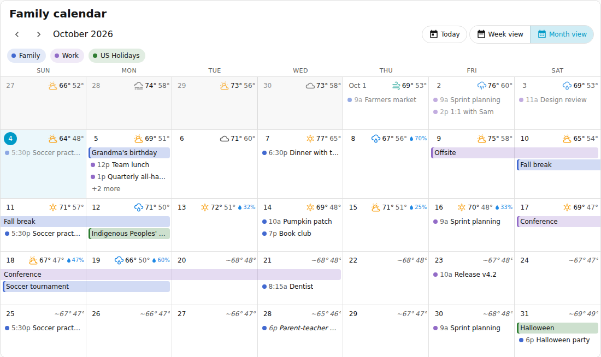
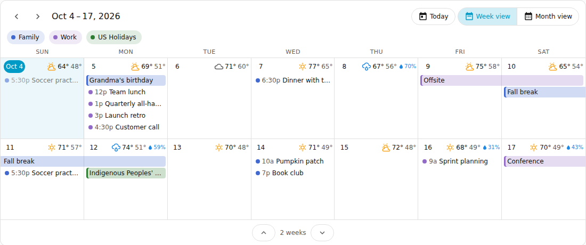
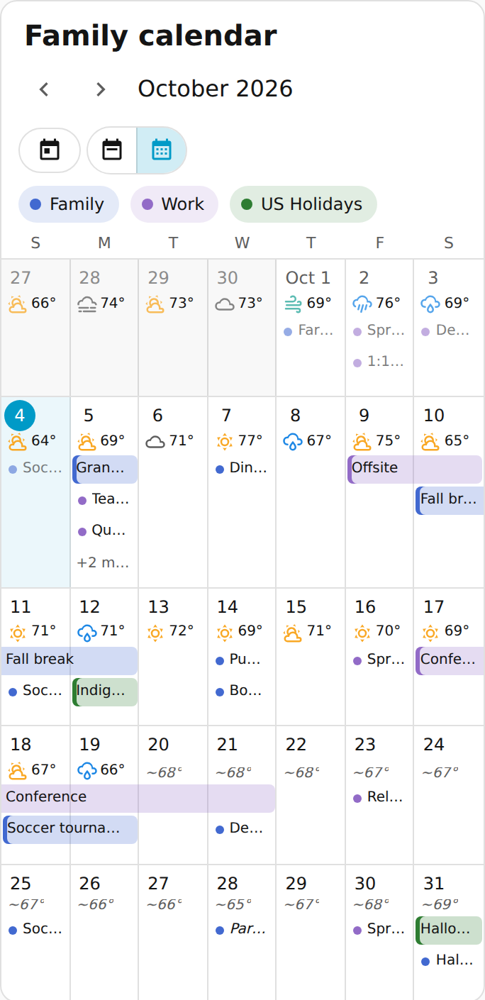
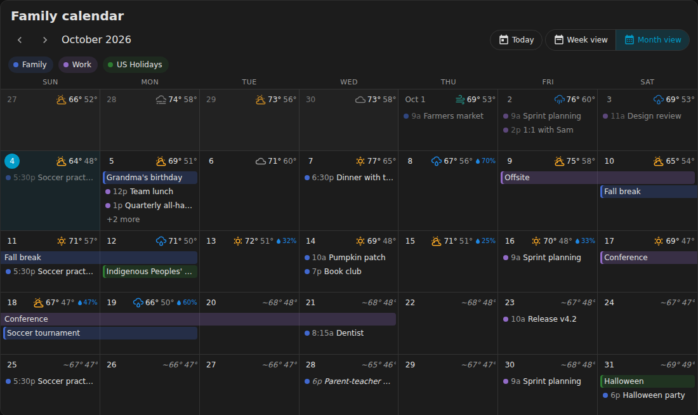
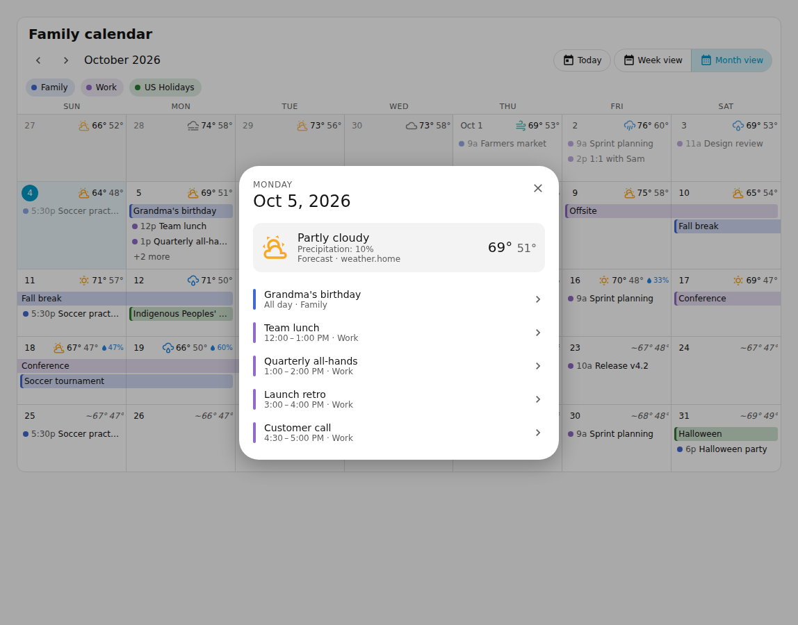

# Month Calendar & Weather card

Part of [JTDHASS](../../README.md). Card type: `custom:jtd-calendar-card`.

A Home Assistant dashboard card that shows your calendars as a **monthly calendar** or an
**expandable Sunday–Saturday week view**, with **weather on every day**: recorded weather for
past days, the forecast for the coming days, and typical weather for the rest of the month.



| Week view (2 weeks, expandable) | Phone width |
| --- | --- |
|  |  |

| Dark theme | Day details |
| --- | --- |
|  |  |

_Screenshots use demo data._

## Features

- **Month view** with Sunday–Saturday rows (Monday-first optional), multi-day events drawn as bars
  across days, timed events with start times, and a "+N more" link when a day is full.
- **Week view** showing 1 to 6 weeks. Expand or shrink it with the ▲/▼ buttons under the grid,
  page through weeks with the arrows, and switch back to the month with one tap.
- **Any Home Assistant calendar** (Google, CalDAV, Local Calendar, Microsoft 365, …). Events update
  live through Home Assistant's `calendar/event/subscribe` API. On older versions the card refreshes
  every 5 minutes instead.
- **Weather for the whole month**:
  - *Past days*: the weather entity's recorded history (condition, highs and lows) and/or the
    long-term statistics of an outdoor temperature sensor, which keep highs and lows for every day.
  - *Today and the coming days*: the forecast from your weather entity.
  - *Gaps* (optional, no API key): [Open-Meteo](https://open-meteo.com) fills days Home Assistant has no
    data for, with history and a 16-day forecast.
  - *Rest of the month* (optional): the typical high/low for that date, averaged over the last 5 years
    (shown as `~68°`).
- **Day and event details** in a dialog: full weather for the day, every event, times, location and
  description.
- **Calendar legend** whose chips show or hide each calendar.
- Built the current Home Assistant way: Lit 3, a visual editor made from Home Assistant's form
  selectors, the sections-view grid (`getGridOptions`), theme colors and design tokens (light and dark
  mode), and layouts that adapt to the card's width with container queries.

## Installation

Install the repository through HACS as described in the [main README](../../README.md#installation);
this card comes with it.

To install only this card by hand, copy [`dist/jtd-calendar-card.js`](../../dist/jtd-calendar-card.js)
to `/config/www/` and add `/local/jtd-calendar-card.js` as a **JavaScript module** dashboard resource.

## Adding the card

Edit a dashboard, select **Add card**, and search for **Month Calendar & Weather**. Everything can be
set in the visual editor. Or use YAML:

```yaml
type: custom:jtd-calendar-card
entities:
  - entity: calendar.family
  - entity: calendar.work
    color: purple
weather_entity: weather.home
```

A configuration that covers every day of the month with weather:

```yaml
type: custom:jtd-calendar-card
title: Family calendar
entities:
  - entity: calendar.family
    name: Family
  - entity: calendar.work
    color: purple
  - calendar.us_holidays # plain entity ids work too
view: month # or "weeks"
weeks: 2 # rows in the week view (1-6)
weather_entity: weather.home
temperature_entity: sensor.outdoor_temperature
open_meteo: true
```

> **Tip (sections view):** a calendar needs room. Open the section's settings and widen it
> (for example to 3 or 4 columns), or put the card in a **Panel** view.

## Options

| Option | Default | Description |
| --- | --- | --- |
| `entities` | — | Calendars. Each item is an entity id or an object with `entity`, `name` and `color`. |
| `title` | — | Text above the calendar. |
| `view` | `month` | View when the dashboard opens: `month` or `weeks`. |
| `weeks` | `2` | Week rows the week view starts with (1–6). |
| `past_weeks` | `0` | Start the week view this many weeks before the current week. |
| `first_day_of_week` | `sunday` | `sunday` or `monday`. |
| `max_events_per_day` | `4` | Event rows per day before "+N more". Doubled in the week view at 1–2 weeks. |
| `show_controls` | `true` | Navigation arrows, Today, view switch and the week expander. |
| `show_legend` | `true` | Calendar chips that show and hide calendars (when there are 2 or more). |
| `show_event_time` | `true` | Start time in front of timed events. |
| `dim_past` | `true` | Fade past days and events. |
| `weather_entity` | — | `weather.*` entity for the forecast; its recorded history covers past days. |
| `temperature_entity` | — | Outdoor temperature sensor. Its long-term statistics give highs and lows for any past day. |
| `show_forecast` | `true` | Show weather for today and future days. |
| `show_history` | `true` | Show weather for past days. |
| `show_precipitation` | `true` | Show the chance of precipitation on forecast days when it is 20% or more (on wide cards). |
| `open_meteo` | `false` | Fill days without weather from Open-Meteo for your home location. |
| `show_normals` | `true` | With `open_meteo`, show the 5-year average for days past the 16-day forecast. |

### Calendar colors

Colors are chosen in this order:

1. `color` in the card configuration: a Home Assistant color name (`red`, `teal`, `primary`, …) or any
   CSS color (`"#e91e63"`).
2. The color picked in the calendar entity's settings (**Settings → Entities → your calendar →
   ⚙️**), the same one the built-in calendar uses.
3. Home Assistant's theme palette.

### Where the weather comes from

| Days | Source (first that has data wins) | Shown as |
| --- | --- | --- |
| Before today | temperature sensor statistics (highs/lows) + weather entity history (condition) → Open-Meteo history¹ | icon, high, low |
| Today and the next days your forecast covers (often 5–10) | weather entity forecast → Open-Meteo forecast¹ | icon, high, low, rain chance |
| Up to 16 days ahead | Open-Meteo forecast¹ | icon, high, low, rain chance |
| Further ahead | 5-year average for the date¹ | `~high low` in italics |

¹ Only with `open_meteo: true`.

Hovering a day's weather shows whether it is a forecast, observed or typical; selecting the day also
shows which entity or service it came from.

Home Assistant keeps state history for 10 days by default (`purge_keep_days`), so past-day
**conditions** from the weather entity reach back about that far. The temperature sensor's statistics
are kept indefinitely, which is why `temperature_entity` is the best way to get highs and lows for a
whole past month.

**Privacy:** with `open_meteo: true`, your browser sends your home's coordinates (rounded to about
1 km) to `api.open-meteo.com` and `archive-api.open-meteo.com`. Nothing else is sent and no key is
needed. Leave it off to use Home Assistant data only.

## Theming

The card follows your Home Assistant theme. These optional variables change the weather icon colors:

```yaml
jtd-calendar-sun-color: "#f9a825"
jtd-calendar-night-color: "#7e8fbf"
jtd-calendar-cloud-color: "#9e9e9e"
jtd-calendar-rain-color: "#1e88e5"
jtd-calendar-snow-color: "#4fc3f7"
jtd-calendar-storm-color: "#7e57c2"
jtd-calendar-wind-color: "#26a69a"
```

## Development

Run the commands from the repository root (see [Development](../../README.md#development)).

```bash
npm run build      # builds dist/jtd-calendar-card.js and the dist/jtdhass.js bundle
npm test           # unit tests, including this card's date math, event layout and weather tests
```

[`demo/index.html`](demo/index.html) renders the card with a mocked Home Assistant connection. Serve the
repository root (for example `npx serve .`) and open `/cards/calendar/demo/index.html?variant=month`;
other variants are `weeks`, `weeks1` and `plain`, and `&theme=dark` switches to dark mode.
`node cards/calendar/demo/screenshot.mjs` saves screenshots using Playwright.
